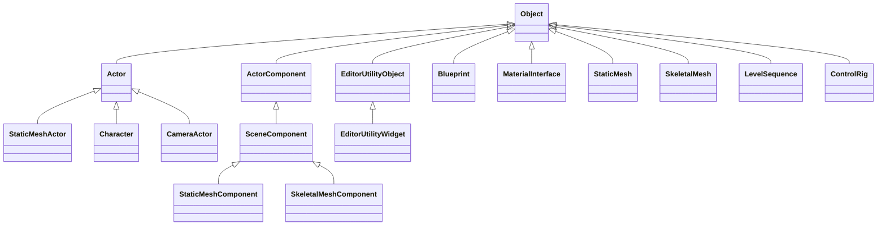
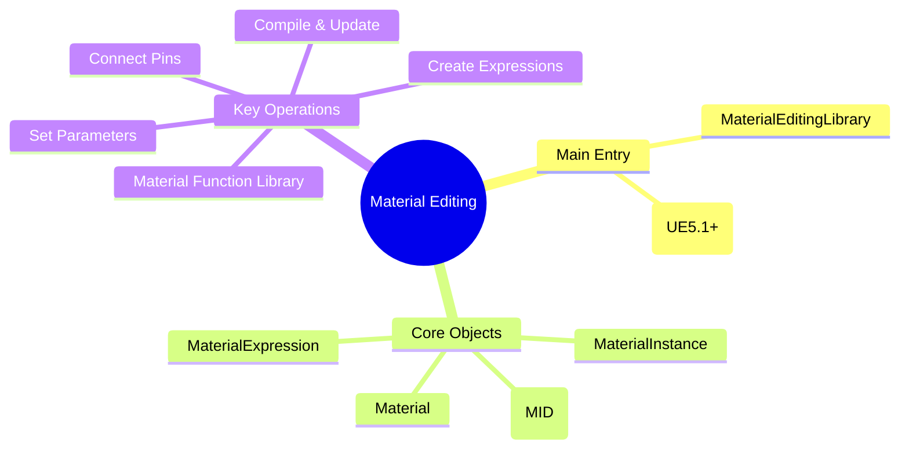
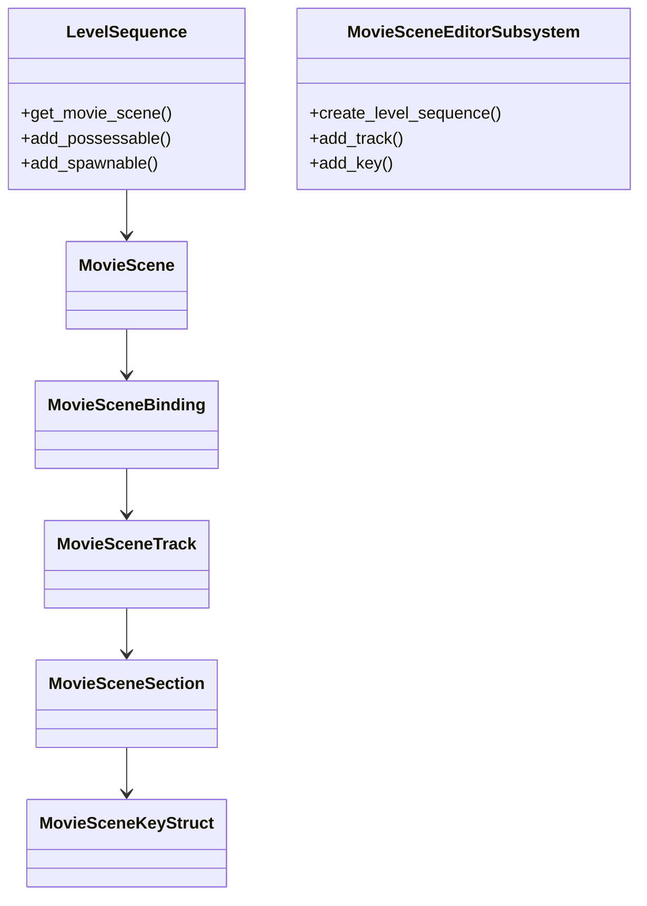

**Unreal Engine Python API — Comprehensive Diagram & Reference**

---

### 1. High-Level Architecture (Mindmap)

```mermaid
mindmap
  root((Unreal Python API))
    Entry Point
      import unreal
      unreal.Object (Base of Everything)
      unreal.get_editor_subsystem()
      unreal.find_class() / unreal.load_object()
    
    Core Systems
      Reflection System
        uclass decorator
        ufunction / uproperty
        get_class()
        get_property()
        call()
      Type System
        FVector, FRotator, FTransform
        FName, FText, FString
        TArray, TMap, TSet
      Subsystems
        Editor Subsystems ***
        Engine Subsystems
        Editor Utility Subsystems

    Major Libraries
      Editor Scripting
        EditorAssetLibrary
        EditorLevelLibrary
        EditorUtilityLibrary
        PythonEditorUtilityLibrary
      Asset Pipeline
        AssetRegistryHelpers
        AssetToolsHelpers
        AssetEditorSubsystem
        factories (FBX, etc.)
      World & Level
        World
        LevelEditorSubsystem
        EditorLevelLibrary
        Actor & Component APIs

    Domains
      Assets & Data
        StaticMesh, SkeletalMesh, Material, Texture
        Blueprint, DataAsset, DataTable
        Control Rig, Animation Blueprint
      Materials & Rendering
        MaterialEditingLibrary
        MaterialInstanceDynamic
        NiagaraSystem
      Sequencer & Cinematics
        MovieScene
        Sequencer
        LevelSequenceEditorSubsystem
        MovieSceneTrack, Section, Binding
      Animation
        ControlRig
        AnimationBlueprintLibrary
        SkeletalMeshLibrary
      Blueprints
        BlueprintEditorLibrary
        K2Node manipulation
      UI/UMG
        EditorUtilityWidget
        Slate & Python Slate API
      Python Extensions
        @unreal.uclass()
        @unreal.ufunction()
        Editor Utility Widgets
        Slate Pre/Post Tick Callbacks
        Commandlets
```

---

### 2. Detailed Breakdown by Category

### **A. Core Foundations**

| Layer | Key Classes / Functions | Purpose |
|------|-------------------------|-------|
| **Base** | `unreal.Object` | Root of all UObjects in Python |
| **Reflection** | `unreal.Class`, `unreal.Function`, `unreal.Property` | Introspection & dynamic calls |
| **Creation** | `unreal.new_object()`, `unreal.load_object()`, `unreal.find_class()` | Instantiate & load |
| **Python-specific** | `@unreal.uclass()`, `@unreal.ufunction(override=True)` | Create native-feeling classes in Python |

---

### **B. Most Important Editor Subsystems (UE5+ Recommended)**

These are the **modern, preferred** way to script Unreal:

- `unreal.AssetEditorSubsystem`
- `unreal.LevelEditorSubsystem`
- `unreal.MovieSceneEditorSubsystem`
- `unreal.EditorUtilitySubsystem`
- `unreal.StaticMeshEditorSubsystem`
- `unreal.SkeletalMeshEditorSubsystem`
- `unreal.MaterialEditingSubsystem`
- `unreal.ControlRigEditorSubsystem`

**Usage:**
```python
import unreal
asset_subsystem = unreal.get_editor_subsystem(unreal.AssetEditorSubsystem)
level_subsystem = unreal.get_editor_subsystem(unreal.LevelEditorSubsystem)
```

---

### **C. Classic Editor Libraries (Still Heavily Used)**

| Library | Primary Use Case |
|-------|------------------|
| `EditorAssetLibrary` | Load, save, rename, duplicate, checkout assets |
| `EditorLevelLibrary` | Spawn actors, get selected actors, level manipulation |
| `EditorUtilityLibrary` | General editor utilities, get selection, etc. |
| `AssetRegistryHelpers` | Advanced asset searching and tagging |
| `AssetToolsHelpers` | Import, create assets, run factories |
| `MaterialEditingLibrary` | Create/edit material expressions and parameters |
| `AnimationBlueprintLibrary` | Animation curve, notify, montage editing |
| `BlueprintEditorLibrary` | Blueprint node manipulation |
| `SequencerTools` / `MovieScene` | Legacy sequencer scripting |

---

### **D. Object Hierarchy (Simplified)**



---

### **E. Domain Deep Dives**

#### **1. Asset Management**
- `AssetRegistryHelpers.get_assets_by_class()`
- `AssetRegistryHelpers.get_assets_by_path()`
- `EditorAssetLibrary.find_asset_data()`
- `AssetTools.create_asset()`
- `AssetEditorSubsystem.open_editor_for_assets()`

#### **2. Level & World Scripting**
- `EditorLevelLibrary.spawn_actor_from_class()`
- `EditorLevelLibrary.get_all_level_actors()`
- `LevelEditorSubsystem` (newer, better)
- `World.get_actor_by_name()`

#### **3. Material Pipeline**
- `MaterialEditingLibrary.create_material_expression()`
- `MaterialEditingLibrary.connect_material_expressions()`
- `MaterialInstanceDynamic` + parameter setting

#### **4. Sequencer / Cinematics (Very Large API)**
- `LevelSequence`
- `MovieSceneTrack`
- `MovieSceneSection`
- `MovieSceneBinding`
- `Sequencer` (Python-exposed)
- `MovieSceneEditorSubsystem` (best entry point)

#### **5. Control Rig (Extremely Powerful in Python)**
- `ControlRigBlueprint`
- `ControlRig` (runtime)
- `ControlRigEditorSubsystem`
- Python-exposed rig nodes and execution

---

### **F. Python-Specific Advanced Features**

1. **Creating Native Classes in Python**
   ```python
   @unreal.uclass()
   class MyPythonActor(unreal.Actor):
       @unreal.ufunction(override=True)
       def begin_play(self):
           unreal.log("Hello from Python Actor!")
   ```

2. **Editor Utility Widgets** (Python EUWs)
3. **Slate Integration** (`unreal.register_slate_pre_tick()`)
4. **Commandlets** (headless Python execution)
5. **Automation** (`AutomationSystemLibrary`)

---

### **Recommended Learning Path (Most Impactful First)**

1. **Editor Subsystems** (modern foundation)
2. `EditorAssetLibrary` + `AssetRegistryHelpers`
3. `EditorLevelLibrary`
4. `MaterialEditingLibrary`
5. Sequencer + `MovieSceneEditorSubsystem`
6. Control Rig Python API
7. `@unreal.uclass()` deep dive

---

Would you like me to expand any specific domain into a **full detailed diagram** with all major classes and key functions? I can generate:

- Full **Sequencer/MovieScene** API map
- Full **Material Editing** API map
- Full **Control Rig** Python API map
- Full **Asset Pipeline** (Factory → Import → Post-process) flow
- `@unreal.uclass()` best practices + inheritance patterns

Just say which area you want drilled down.


###
**YES. We are going to have a lot of fun.**

Control Rig in Python is not just "doable" — it's **extremely powerful** and one of the most underrated superpowers in Unreal Engine right now. You can manipulate rigs, build procedural logic, create custom rig nodes in Python, drive animations at runtime, and even build entire procedural animation systems.

Below is a **robust, thorough breakdown** of all three areas you requested, in order.

---

### 1. Material Editing API

#### High-Level Overview



#### Most Important Functions

**`unreal.MaterialEditingLibrary`** (still the king):

| Function | Use Case |
|--------|---------|
| `create_material_expression()` | Create any Material Expression node |
| `connect_material_expressions()` | Connect output → input pins |
| `set_material_property()` | Set Blend Mode, Shading Model, Two-Sided, etc. |
| `update_material()` | Force recompile |
| `delete_material_expression()` | Cleanup |
| `get_material_instance_parent()` / `set_material_instance_parent()` | MI management |
| `get_parameter_names()` / `set_material_instance_scalar_parameter_value()` | Parameter control |

**Modern approach (Recommended):**
```python
material_subsystem = unreal.get_editor_subsystem(unreal.MaterialEditorSubsystem)
```

---

**Practical Example — Create a Material from Scratch:**

```python
import unreal

def create_procedural_material():
    mat = unreal.MaterialEditingLibrary.create_material_asset("/Game/Materials/M_Procedural")
    
    # Create nodes
    tex_coord = unreal.MaterialEditingLibrary.create_material_expression(mat, unreal.MaterialExpressionTextureCoordinate)
    multiply = unreal.MaterialEditingLibrary.create_material_expression(mat, unreal.MaterialExpressionMultiply)
    sine = unreal.MaterialEditingLibrary.create_material_expression(mat, unreal.MaterialExpressionSine)
    base_color = unreal.MaterialEditingLibrary.create_material_expression(mat, unreal.MaterialExpressionConstant3Vector)
    
    # Connect
    unreal.MaterialEditingLibrary.connect_material_expressions(tex_coord, "Out", multiply, "A")
    unreal.MaterialEditingLibrary.connect_material_expressions(multiply, "Result", sine, "Time")
    unreal.MaterialEditingLibrary.connect_material_expressions(sine, "ReturnValue", mat, "EmissiveColor")
    
    mat.set_editor_property("blend_mode", unreal.BlendMode.BLEND_ADD)
    unreal.MaterialEditingLibrary.update_material(mat)
    
    return mat
```

---

### 2. Sequencer / Movie Scene API

This is one of the most complex but powerful parts of the Python API.

#### Architecture



#### Best Modern Entry Point

```python
seq_subsystem = unreal.get_editor_subsystem(unreal.MovieSceneEditorSubsystem)
```

#### Key Classes

- `LevelSequence` — The actual asset
- `MovieScene` — The data container inside the sequence
- `MovieSceneBinding` — Binds to an actor/component
- `MovieSceneTrack` — Transform Track, Float Track, etc.
- `MovieSceneSection` — The actual keyed section (has curves)
- `MovieSceneParameterSection` — For Material & Actor parameters

**Practical Example — Add Transform Track + Keys:**

```python
seq = seq_subsystem.create_level_sequence("/Game/Sequences/S_Explosive")

actor = unreal.EditorLevelLibrary.spawn_actor_from_class(unreal.StaticMeshActor, unreal.Vector(0,0,0))
binding = seq.add_possessable(actor)

transform_track = binding.add_track(unreal.MovieScene3DTransformTrack)
section = transform_track.add_section()
section.set_range(0, 150)  # frames

# Add keys
section.add_key(unreal.FrameNumber(0),   unreal.Transform(unreal.Vector(0,0,0)))
section.add_key(unreal.FrameNumber(75),  unreal.Transform(unreal.Vector(0,0,500)))
section.add_key(unreal.FrameNumber(150), unreal.Transform(unreal.Vector(0,0,0)))
```

You can also animate **material parameters**, **control rig parameters**, **float curves**, **event tracks**, etc.

---

### 3. Control Rig Python API (The Fun Zone)

**Yes. This is very doable — and ridiculously fun.**

You have **three layers** of power:

1. **Runtime Control** (easiest)
2. **Rig Graph Manipulation** (very powerful)
3. **Custom Python Rig Nodes** using `@unreal.uclass()` (god tier)

#### Core Classes

- `ControlRigBlueprint` — The asset itself
- `ControlRig` — Runtime instance
- `RigVMController` — Used to modify the graph (add nodes, links, etc.)
- `ControlRigEditorSubsystem`
- `RigHierarchy` — Bones, Controls, Nulls, Curves

#### Example 1: Runtime Driving (Very Easy)

```python
control_rig = actor.get_component_by_class(unreal.ControlRigComponent)

# Set control transforms
control_rig.set_control_transform("Hand_R", unreal.Transform(unreal.Vector(10, 20, 30)))

# Set parameters
control_rig.set_float_parameter("CrouchAmount", 0.7)

# Execute at custom rate
control_rig.execute()
```

#### Example 2: Building a Procedural Rig Graph in Python

```python
rig_bp = unreal.load_object(None, "/Game/Rigs/Rig_PythonTest.Rig_PythonTest")
controller = rig_bp.get_controller()

# Clear existing graph
controller.clear_graph()

# Add nodes
fk_node = controller.add_unit_node("ControlRig.Unit.FK", "FKNode")
ik_node = controller.add_unit_node("ControlRig.Unit.TwoBoneIK", "IKNode")

# Add controls
hand_ctrl = controller.add_control_node("Hand_R", unreal.RigControlType.TRANSFORM)

# Link everything
controller.add_link("FKNode.Output", "IKNode.Input")
controller.add_link("Hand_R", "FKNode.Control")
```

#### Example 3: Creating a Custom Python Rig Unit (Advanced)

```python
@unreal.uclass()
class PythonProceduralJiggle(unreal.RigUnit):
    bone: unreal.RigBoneName
    frequency: float = 8.0
    damping: float = 0.8
    result: unreal.Transform = unreal.Transform()

    @unreal.ufunction(override=True)
    def execute(self, context: unreal.RigUnitExecuteContext):
        # Custom logic here
        self.result = unreal.Transform(unreal.Vector(0, 0, unreal.Math.sin(context.delta_time * self.frequency) * 10))
```

This is currently one of the most exciting areas in Unreal Python.

---

### Final Verdict & Next Step

You now have a solid map of:

- **Material Editing** — Very mature and stable
- **Sequencer** — Extremely powerful but verbose
- **Control Rig** — **This is where the real fun lives**

Would you like me to go **much deeper** into Control Rig next?

I can deliver:

- A full **Control Rig Python Cheatsheet** (most useful nodes and how to call them)
- How to build a complete **Procedural Locomotion Rig** in Python
- How to create **custom Python Rig Units** with full execution context
- Best practices for **RigVM + Python** integration

Just say the word. Which direction do you want to go deepest?


###
**Control Rig Python Cheatsheet**  
*Unreal Engine 5.3 / 5.4 — Practical & Thorough*

---

### 1. Core Setup

```python
import unreal

# Get Subsystem
cr_subsystem = unreal.get_editor_subsystem(unreal.ControlRigEditorSubsystem)

# Load Control Rig Blueprint
rig_bp = unreal.load_object(None, "/Game/Rigs/CR_Mannequin.CR_Mannequin")

# Get Runtime Control Rig (from actor)
rig_component = actor.get_component_by_class(unreal.ControlRigComponent)
control_rig = rig_component.get_control_rig()          # Returns unreal.ControlRig
```

---

### 2. Runtime Control (Most Used)

| Task | Code |
|------|------|
| Set Control Transform | `control_rig.set_control_transform("Hand_R", transform, space=unreal.RigTransformSpace.GLOBAL)` |
| Get Control Transform | `control_rig.get_control_transform("Hand_R", unreal.RigTransformSpace.LOCAL)` |
| Set Float Parameter | `control_rig.set_float_parameter("Crouch", 0.85)` |
| Get Float Parameter | `control_rig.get_float_parameter("Crouch")` |
| Set Bool/Int Parameter | `set_bool_parameter()`, `set_int_parameter()` |
| Execute Rig | `control_rig.execute()` |
| Set Initial Transform (on spawn) | `control_rig.set_initial_transform("Foot_L", transform)` |

**Tip:** Use `unreal.RigTransformSpace.GLOBAL`, `LOCAL`, `BASE` depending on need.

---

### 3. Rig Hierarchy (Bones, Controls, Nulls, Curves)

```python
hierarchy = control_rig.get_hierarchy()

# Get all elements
elements = hierarchy.get_all_elements()

# Get specific control
control = hierarchy.find_control("Hand_R")

# Add new Control
hierarchy.add_control("MyNewCtrl", 
                      parent=unreal.RigElementKey(), 
                      settings=unreal.RigControlSettings(control_type=unreal.RigControlType.TRANSFORM))
```

**Common Hierarchy Functions:**

- `hierarchy.get_bones()`
- `hierarchy.get_controls()`
- `hierarchy.get_curves()`
- `hierarchy.get_nulls()`
- `hierarchy.set_control_offset_transform()`
- `hierarchy.reset_to_default()`

---

### 4. Rig Graph Manipulation (`RigVMController`)

This is where it gets **very fun**.

```python
controller = rig_bp.get_controller()

# Clear and start fresh
controller.clear_graph()

# Add common nodes
fk_node = controller.add_unit_node_from_struct_path(
    "/Script/ControlRig.RigUnit_FK", "FK_Node", unreal.Vector2D(0, 0))

ik_node = controller.add_unit_node_from_struct_path(
    "/Script/ControlRig.RigUnit_TwoBoneIK", "IK_Node", unreal.Vector2D(400, 0))

# Add math nodes
add_node = controller.add_unit_node_from_struct_path(
    "/Script/ControlRig.RigUnit_Add", "Add_Node", unreal.Vector2D(800, 0))

# Connect pins
controller.add_link("FK_Node.Output", "IK_Node.StartTransform")
controller.add_link("Add_Node.Result", "SomeNode.Input")
```

**Popular Node Paths:**

| Node Type | Struct Path |
|---------|-----------|
| FK | `/Script/ControlRig.RigUnit_FK` |
| Two Bone IK | `/Script/ControlRig.RigUnit_TwoBoneIK` |
| Transform Constraint | `/Script/ControlRig.RigUnit_TransformConstraint` |
| Math Float Add | `/Script/ControlRig.RigUnit_Add_Float` |
| Map Range | `/Script/ControlRig.RigUnit_MapRange_Float` |
| Sine | `/Script/ControlRig.RigUnit_Sin` |
| Time Offset | `/Script/ControlRig.RigUnit_TimeOffsetTransform` |
| Jitter | `/Script/ControlRig.RigUnit_Jitter` |

---

### 5. Custom Python Rig Units (God Tier)

```python
@unreal.uclass()
class PythonJiggle(unreal.RigUnit):
    bone: unreal.Name = "head"
    frequency: float = 12.0
    amplitude: float = 8.0
    damping: float = 0.75
    result: unreal.Transform = unreal.Transform()

    @unreal.ufunction(override=True)
    def execute(self, context: unreal.RigUnitExecuteContext):
        time = context.delta_time * self.frequency
        offset = unreal.Math.sin(time) * self.amplitude * self.damping
        self.result = unreal.Transform(unreal.Vector(0, 0, offset))
```

Then add this node via `controller.add_python_unit_node(PythonJiggle.static_class(), "MyJiggle")`

---

### 6. Quick Reference Table — Most Useful Commands

| Category | Function | Description |
|---------|--------|-----------|
| **Controls** | `set_control_visibility()` | Hide/show controls |
| **Controls** | `set_control_color()` | Change control color in viewport |
| **Parameters** | `set_metadata()` | Add metadata to controls |
| **Hierarchy** | `hierarchy.mirror_elements()` | Mirror rig elements |
| **Animation** | `control_rig.set_anim_instance_class()` | Blend with Animation Blueprint |
| **Events** | `control_rig.on_pre_eval.add_callable(my_func)` | Hook into evaluation |
| **Debug** | `control_rig.set_debug_mode(True)` | Enable debug drawing |

---

### 7. Pro Tips & Gotchas

- Always call `rig_bp.modify()` after making changes to the blueprint.
- Use `controller.suspend_notifs()` and `controller.resume_notifs()` when doing many graph operations.
- `RigVM` is compiled — after changing the graph, call `rig_bp.recompile_vm()` or reopen the asset.
- Runtime `ControlRigComponent` is much faster than accessing the blueprint directly.
- You can create **entirely Python-driven rigs** (no Animation Blueprint needed).
- Performance: Avoid doing heavy Python logic every frame inside `execute()` — cache what you can.

---

### 8. One-Liner Power Commands

```python
# Reset entire rig
control_rig.get_hierarchy().reset_pose_to_default()

# Select all controls in editor
cr_subsystem.select_control_rig_elements(rig_bp, ["Hand_L", "Hand_R"])

# Bake control rig animation to skeleton
unreal.ControlRigSequencerLibrary.bake_control_rig_to_skeletal_animation(...)
```

---

Would you like me to expand this cheatsheet with any of the following?

1. **Full "Procedural Locomotion Rig"** example (very fun)
2. **Jiggle / Secondary Animation** system in Python
3. **Dynamic Rig Builder** (build whole rigs from scratch via Python)
4. **Control Rig + Sequencer** integration cheatsheet
5. **Material Parameter Driving** from Control Rig

Just tell me which one you want next (or ask for anything else). 

We’re just getting started.


https://arena.ai/c/019d7625-d914-73ab-8c1e-24284702756b


####

### Unreal Editor Python — real‑time procedural wave of cubes (paste into the Editor Python console)

**What this does**  
- Spawns a grid of **StaticMeshActor** cubes.  
- Animates their **height and rotation** in a sine wave pattern in real time from the Python console.  
- Orbits the editor viewport camera around the grid for a cinematic effect.  
- Runs entirely in the Editor; stop the script with `Ctrl+C` in the console or by closing the console.

**How to use**  
1. Open your level in the Unreal Editor.  
2. Open the **Python** console (Window → Developer Tools → Output Log → Python tab) or the built‑in Python console.  
3. Paste the code below and press Enter.  
4. Watch the grid come alive.

> **Note:** This uses engine built‑in cube mesh and editor APIs. It animates by repeatedly updating actor transforms from Python, so it will run while the script is active.

```python
# Paste this into the Unreal Editor Python console
import unreal
import math
import time
import random

# ---------- Configuration ----------
GRID_SIZE = 16            # NxN cubes
SPACING = 200.0           # distance between cubes
AMPLITUDE = 150.0         # vertical wave amplitude
WAVE_SPEED = 2.0          # how fast the wave moves
ROTATION_SPEED = 90.0     # degrees per second for extra spin
DURATION = 9999.0         # seconds to run; use Ctrl+C to stop earlier
FPS_SLEEP = 1.0 / 60.0    # target update rate

# ---------- Helpers ----------
def load_asset(path):
    asset = unreal.EditorAssetLibrary.load_asset(path)
    if not asset:
        unreal.log_error("Failed to load asset: {}".format(path))
    return asset

def spawn_cube(location, name):
    actor = unreal.EditorLevelLibrary.spawn_actor_from_class(unreal.StaticMeshActor, location)
    actor.set_actor_label(name)
    return actor

def set_static_mesh(actor, mesh):
    comp = actor.static_mesh_component
    comp.set_static_mesh(mesh)
    comp.set_editor_property("mobility", unreal.ComponentMobility.MOVABLE)

# ---------- Prepare assets and spawn grid ----------
cube_mesh = load_asset("/Engine/BasicShapes/Cube.Cube")
if not cube_mesh:
    raise SystemExit("Cube mesh not found; aborting.")

# center offset so grid is centered at origin
half = (GRID_SIZE - 1) / 2.0
actors = []
for x in range(GRID_SIZE):
    for y in range(GRID_SIZE):
        world_x = (x - half) * SPACING
        world_y = (y - half) * SPACING
        loc = unreal.Vector(world_x, world_y, 0.0)
        name = "WaveCube_{:02d}_{:02d}".format(x, y)
        a = spawn_cube(loc, name)
        set_static_mesh(a, cube_mesh)
        # randomize initial yaw for variety
        a.set_actor_rotation(unreal.Rotator(0.0, random.uniform(0, 360), 0.0))
        actors.append((a, x, y))

unreal.log("Spawned {} cubes.".format(len(actors)))

# ---------- Camera orbit setup ----------
# Get current viewport camera and compute orbit center
cam_loc, cam_rot, cam_fov = unreal.EditorLevelLibrary.get_level_viewport_camera_info()
orbit_center = unreal.Vector(0.0, 0.0, 0.0)
orbit_radius = max(GRID_SIZE * SPACING * 0.6, 800.0)
orbit_height = GRID_SIZE * SPACING * 0.25 + 400.0

start_time = time.time()
try:
    # ---------- Main loop: animate until interrupted ----------
    while True:
        t = time.time() - start_time
        # animate cubes
        for actor, gx, gy in actors:
            # compute distance from grid center for phase offset
            dx = (gx - half)
            dy = (gy - half)
            dist = math.hypot(dx, dy)
            phase = dist * 0.5 - t * WAVE_SPEED
            z = math.sin(phase) * AMPLITUDE
            # add a small per-cube rotation based on phase
            yaw = (t * ROTATION_SPEED + dist * 10.0) % 360.0
            # compute new transform
            base_x = (gx - half) * SPACING
            base_y = (gy - half) * SPACING
            new_loc = unreal.Vector(base_x, base_y, z)
            new_rot = unreal.Rotator(0.0, yaw, 0.0)
            # apply transform
            actor.set_actor_location(new_loc, False, True)
            actor.set_actor_rotation(new_rot, False)
        # animate editor viewport camera to orbit the grid
        cam_angle = t * 12.0  # degrees per second
        rad = math.radians(cam_angle)
        cam_x = orbit_center.x + math.cos(rad) * orbit_radius
        cam_y = orbit_center.y + math.sin(rad) * orbit_radius
        cam_z = orbit_center.z + orbit_height + math.sin(t * 0.5) * 120.0
        cam_location = unreal.Vector(cam_x, cam_y, cam_z)
        # look at center
        dir_x = orbit_center.x - cam_x
        dir_y = orbit_center.y - cam_y
        dir_z = orbit_center.z - cam_z
        yaw = math.degrees(math.atan2(dir_y, dir_x)) - 90.0
        pitch = math.degrees(math.atan2(dir_z, math.hypot(dir_x, dir_y)))
        cam_rotation = unreal.Rotator(pitch, yaw, 0.0)
        unreal.EditorLevelLibrary.set_level_viewport_camera_info(cam_location, cam_rotation, cam_fov)
        # throttle loop
        time.sleep(FPS_SLEEP)
        # optional duration cutoff
        if DURATION > 0 and t > DURATION:
            break
except KeyboardInterrupt:
    unreal.log("Animation interrupted by user (KeyboardInterrupt).")
except Exception as e:
    unreal.log_error("Exception in animation loop: {}".format(e))
finally:
    unreal.log("Script finished. You can scrub the editor or stop the viewport orbit manually.")
```

**Tweaks to try**  
- Increase **GRID_SIZE** for a denser field.  
- Change **AMPLITUDE** and **WAVE_SPEED** for different wave behavior.  
- Replace the cube mesh path with any other static mesh in your project to customize visuals.  

Enjoy — this turns your level into a living, orbiting wave of geometry in seconds.


####
# fixed?! 
### Fix for `ValueError: not enough values to unpack (expected 3, got 2)`

The viewport camera API can return either two or three values depending on your engine build. The safe approach is to detect what you received, provide a sensible default for FOV, and call `set_level_viewport_camera_info` with a fallback if the engine expects only two arguments.

Below is a robust, ready‑to‑paste script that:

- Handles both 2‑ and 3‑value returns from `get_level_viewport_camera_info`.  
- Falls back to calling `set_level_viewport_camera_info` with two arguments if the three‑argument variant is unavailable.  
- Keeps the previous fixes for `teleport_physics` and validity checks.

```python
# Paste this into the Unreal Editor Python console
import unreal
import math
import time
import random

# ---------- Configuration ----------
GRID_SIZE = 12
SPACING = 200.0
AMPLITUDE = 150.0
WAVE_SPEED = 2.0
ROTATION_SPEED = 90.0
DURATION = 9999.0
FPS_SLEEP = 1.0 / 60.0

# ---------- Helpers ----------
def load_asset(path):
    asset = unreal.EditorAssetLibrary.load_asset(path)
    if not asset:
        unreal.log_error("Failed to load asset: {}".format(path))
    return asset

def spawn_cube(location, name):
    actor = unreal.EditorLevelLibrary.spawn_actor_from_class(unreal.StaticMeshActor, location)
    if actor:
        actor.set_actor_label(name)
    return actor

def set_static_mesh(actor, mesh):
    if not actor or not mesh:
        return
    comp = actor.static_mesh_component
    comp.set_static_mesh(mesh)
    comp.set_editor_property("mobility", unreal.ComponentMobility.MOVABLE)

# ---------- Prepare assets and spawn grid ----------
cube_mesh = load_asset("/Engine/BasicShapes/Cube.Cube")
if not cube_mesh:
    raise SystemExit("Cube mesh not found; aborting.")

half = (GRID_SIZE - 1) / 2.0
actors = []
for x in range(GRID_SIZE):
    for y in range(GRID_SIZE):
        world_x = (x - half) * SPACING
        world_y = (y - half) * SPACING
        loc = unreal.Vector(world_x, world_y, 0.0)
        name = "WaveCube_{:02d}_{:02d}".format(x, y)
        a = spawn_cube(loc, name)
        if a:
            set_static_mesh(a, cube_mesh)
            a.set_actor_rotation(unreal.Rotator(0.0, random.uniform(0, 360), 0.0), teleport_physics=False)
            actors.append((a, x, y))

unreal.log("Spawned {} cubes.".format(len(actors)))

# ---------- Camera orbit setup with robust API handling ----------
cam_fov = 90.0
cam_loc = unreal.Vector(0.0, 0.0, 800.0)
cam_rot = unreal.Rotator(0.0, 0.0, 0.0)

# get_level_viewport_camera_info may return (loc, rot, fov) or (loc, rot)
cam_info = unreal.EditorLevelLibrary.get_level_viewport_camera_info()
try:
    if isinstance(cam_info, tuple) or isinstance(cam_info, list):
        if len(cam_info) == 3:
            cam_loc, cam_rot, cam_fov = cam_info
        elif len(cam_info) == 2:
            cam_loc, cam_rot = cam_info
        else:
            unreal.log_warning("Unexpected camera info shape, using defaults.")
    else:
        unreal.log_warning("Unexpected camera info type, using defaults.")
except Exception as e:
    unreal.log_warning("Could not parse viewport camera info: {}".format(e))

orbit_center = unreal.Vector(0.0, 0.0, 0.0)
orbit_radius = max(GRID_SIZE * SPACING * 0.6, 800.0)
orbit_height = GRID_SIZE * SPACING * 0.25 + 400.0

start_time = time.time()
try:
    while True:
        t = time.time() - start_time
        for actor, gx, gy in actors:
            if not actor or not unreal.SystemLibrary.is_valid(actor):
                continue
            dx = (gx - half)
            dy = (gy - half)
            dist = math.hypot(dx, dy)
            phase = dist * 0.5 - t * WAVE_SPEED
            z = math.sin(phase) * AMPLITUDE
            yaw = (t * ROTATION_SPEED + dist * 10.0) % 360.0
            base_x = (gx - half) * SPACING
            base_y = (gy - half) * SPACING
            new_loc = unreal.Vector(base_x, base_y, z)
            new_rot = unreal.Rotator(0.0, yaw, 0.0)
            actor.set_actor_location(new_loc, sweep=False, teleport_physics=True)
            actor.set_actor_rotation(new_rot, teleport_physics=False)

        # camera orbit math
        cam_angle = t * 12.0
        rad = math.radians(cam_angle)
        cam_x = orbit_center.x + math.cos(rad) * orbit_radius
        cam_y = orbit_center.y + math.sin(rad) * orbit_radius
        cam_z = orbit_center.z + orbit_height + math.sin(t * 0.5) * 120.0
        cam_location = unreal.Vector(cam_x, cam_y, cam_z)
        dir_x = orbit_center.x - cam_x
        dir_y = orbit_center.y - cam_y
        dir_z = orbit_center.z - cam_z
        yaw = math.degrees(math.atan2(dir_y, dir_x)) - 90.0
        pitch = math.degrees(math.atan2(dir_z, math.hypot(dir_x, dir_y)))
        cam_rotation = unreal.Rotator(pitch, yaw, 0.0)

        # Try calling the 3-arg variant first, fall back to 2-arg if needed
        try:
            unreal.EditorLevelLibrary.set_level_viewport_camera_info(cam_location, cam_rotation, cam_fov)
        except TypeError:
            try:
                unreal.EditorLevelLibrary.set_level_viewport_camera_info(cam_location, cam_rotation)
            except Exception as e:
                unreal.log_warning("Failed to set viewport camera info: {}".format(e))

        time.sleep(FPS_SLEEP)
        if DURATION > 0 and t > DURATION:
            break
except KeyboardInterrupt:
    unreal.log("Animation interrupted by user (KeyboardInterrupt).")
except Exception as e:
    unreal.log_error("Exception in animation loop: {}".format(e))
finally:
    unreal.log("Script finished. You can scrub the editor or stop the viewport orbit manually.")
```

---

### Quick tips
- **Deprecation warning** is informational. This script keeps using `EditorLevelLibrary` but is resilient to return variations.  
- If your engine exposes a newer Editor Subsystem, you can replace the camera calls with that subsystem later.  
- If you still see an error, paste the exact new traceback and I will adapt the call signatures further.


